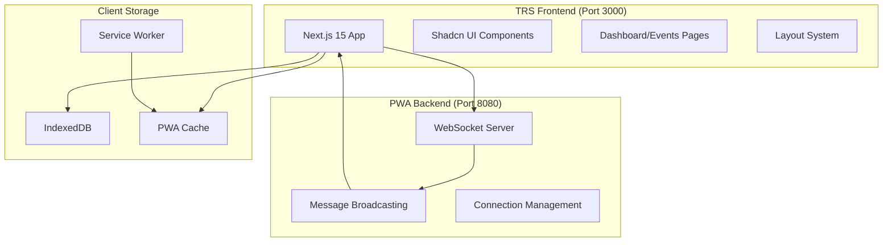

# TRS Frontend + PWA Backend Integration Guide

This document explains how to integrate the **TRS Frontend** (Next.js 15 with Shadcn UI) with the **PWA WebSocket Backend** for real-time communication and enhanced functionality.

## 🎯 Integration Overview

### Current Setup
- **TRS Frontend**: Next.js 15 + TypeScript + Shadcn UI + Tailwind CSS v4
- **PWA Backend**: WebSocket server + Next.js PWA + IndexedDB + Real-time messaging

### Integration Benefits
- ✅ **Real-time Communication** - WebSocket integration for live updates
- ✅ **Offline Support** - PWA capabilities with IndexedDB
- ✅ **Professional UI** - TRS Frontend's Shadcn UI components
- ✅ **Modern Architecture** - Best of both applications
- ✅ **Type Safety** - Full TypeScript integration

## 🏗 Architecture Design



## 📝 Step-by-Step Integration

### Step 1: Prepare the Integration Environment

#### 1.1 Copy PWA Components to TRS Frontend
```bash
# Navigate to TRS Frontend
cd trs_front

# Create integration directories
mkdir -p src/lib/pwa
mkdir -p src/hooks/pwa
mkdir -p src/components/realtime
mkdir -p src/types/pwa
```

#### 1.2 Install Additional Dependencies
```bash
npm install ws uuid idb
npm install -D @types/ws @types/uuid
```

### Step 2: Integrate WebSocket Backend

#### 2.1 Copy WebSocket Server
```javascript
// server/websocket-server.js (copy from PWA project)
const { WebSocketServer } = require('ws')
const { randomUUID } = require('crypto')

const PORT = 8080
const connections = new Map()
const messages = []
const MAX_MESSAGES = 100

// ... (complete WebSocket server implementation)
```

#### 2.2 Update Package.json Scripts
```json
{
  "scripts": {
    "dev": "concurrently \"npm run ws-server\" \"next dev --turbopack\"",
    "ws-server": "node server/websocket-server.js",
    "build": "next build",
    "start": "concurrently \"npm run ws-server\" \"next start\""
  }
}
```

### Step 3: Create PWA Integration Layer

#### 3.1 TypeScript Types
```typescript
// src/types/pwa/index.ts
export interface WebSocketMessage {
  type: 'message' | 'connected' | 'userCount' | 'ping' | 'pong' | 'status'
  clientId?: string
  content?: string
  count?: number
  userCount?: number
  timestamp?: string
}

export interface RealtimeEvent {
  id: string
  type: 'transport_update' | 'user_action' | 'system_notification'
  data: any
  timestamp: string
  userId?: string
}

export interface ConnectionState {
  connected: boolean
  connecting: boolean
  userCount: number
  clientId: string | null
}
```

#### 3.2 WebSocket Hook
```typescript
// src/hooks/pwa/useWebSocket.ts
import { useState, useEffect, useCallback, useRef } from 'react'
import { WebSocketMessage, RealtimeEvent } from '@/types/pwa'

export function useWebSocket(url: string) {
  const [connected, setConnected] = useState(false)
  const [userCount, setUserCount] = useState(0)
  const [events, setEvents] = useState<RealtimeEvent[]>([])
  
  const wsRef = useRef<WebSocket | null>(null)
  const reconnectAttemptsRef = useRef(0)
  const maxReconnectAttempts = 5

  const connect = useCallback(() => {
    if (wsRef.current?.readyState === WebSocket.OPEN) return

    try {
      wsRef.current = new WebSocket(url)
      
      wsRef.current.onopen = () => {
        setConnected(true)
        reconnectAttemptsRef.current = 0
        console.log('WebSocket connected to TRS Backend')
      }

      wsRef.current.onmessage = (event) => {
        try {
          const message: WebSocketMessage = JSON.parse(event.data)
          
          switch (message.type) {
            case 'connected':
              if (message.userCount !== undefined) {
                setUserCount(message.userCount)
              }
              break
            case 'userCount':
              if (message.count !== undefined) {
                setUserCount(message.count)
              }
              break
            case 'message':
              // Convert to RealtimeEvent for TRS
              if (message.content && message.clientId && message.timestamp) {
                const event: RealtimeEvent = {
                  id: `${message.clientId}-${Date.now()}`,
                  type: 'user_action',
                  data: { content: message.content },
                  timestamp: message.timestamp,
                  userId: message.clientId
                }
                setEvents(prev => [event, ...prev].slice(0, 50))
              }
              break
          }
        } catch (error) {
          console.error('Failed to parse WebSocket message:', error)
        }
      }

      wsRef.current.onclose = () => {
        setConnected(false)
        scheduleReconnect()
      }

    } catch (error) {
      console.error('WebSocket connection failed:', error)
      scheduleReconnect()
    }
  }, [url])

  const scheduleReconnect = useCallback(() => {
    if (reconnectAttemptsRef.current >= maxReconnectAttempts) return

    const delay = 3000 * Math.pow(2, reconnectAttemptsRef.current)
    setTimeout(() => {
      reconnectAttemptsRef.current++
      connect()
    }, delay)
  }, [connect])

  const sendEvent = useCallback((event: Omit<RealtimeEvent, 'id' | 'timestamp'>) => {
    if (!wsRef.current || wsRef.current.readyState !== WebSocket.OPEN) return false

    const message: WebSocketMessage = {
      type: 'message',
      content: JSON.stringify(event),
      timestamp: new Date().toISOString()
    }

    try {
      wsRef.current.send(JSON.stringify(message))
      return true
    } catch (error) {
      console.error('Failed to send event:', error)
      return false
    }
  }, [])

  useEffect(() => {
    connect()
    return () => wsRef.current?.close()
  }, [connect])

  return {
    connected,
    userCount,
    events,
    sendEvent,
    reconnect: connect
  }
}
```

#### 3.3 IndexedDB Integration
```typescript
// src/lib/pwa/database.ts
import { openDB, DBSchema, IDBPDatabase } from 'idb'
import { RealtimeEvent } from '@/types/pwa'

interface TRSDatabase extends DBSchema {
  events: {
    key: string
    value: RealtimeEvent
    indexes: {
      'timestamp': string
      'type': string
      'userId': string
    }
  }
  settings: {
    key: string
    value: {
      key: string
      value: any
      timestamp: string
    }
  }
}

class TRSDatabase {
  private db: IDBPDatabase<TRSDatabase> | null = null
  private readonly DB_NAME = 'TRSDatabase'
  private readonly DB_VERSION = 1

  async init(): Promise<void> {
    if (this.db) return

    this.db = await openDB<TRSDatabase>(this.DB_NAME, this.DB_VERSION, {
      upgrade(db) {
        // Events store
        if (!db.objectStoreNames.contains('events')) {
          const eventStore = db.createObjectStore('events', { keyPath: 'id' })
          eventStore.createIndex('timestamp', 'timestamp')
          eventStore.createIndex('type', 'type')
          eventStore.createIndex('userId', 'userId')
        }

        // Settings store
        if (!db.objectStoreNames.contains('settings')) {
          db.createObjectStore('settings', { keyPath: 'key' })
        }
      },
    })
  }

  async addEvent(event: RealtimeEvent): Promise<void> {
    if (!this.db) await this.init()
    await this.db!.add('events', event)
  }

  async getEvents(limit = 50): Promise<RealtimeEvent[]> {
    if (!this.db) await this.init()
    
    const events = await this.db!.getAllFromIndex('events', 'timestamp')
    return events
      .sort((a, b) => new Date(b.timestamp).getTime() - new Date(a.timestamp).getTime())
      .slice(0, limit)
  }

  async getEventsByType(type: RealtimeEvent['type']): Promise<RealtimeEvent[]> {
    if (!this.db) await this.init()
    return await this.db!.getAllFromIndex('events', 'type', type)
  }
}

export const trsDatabase = new TRSDatabase()
```

### Step 4: Create Real-time Components

#### 4.1 Connection Status Component
```tsx
// src/components/realtime/ConnectionStatus.tsx
import { Badge } from '@/components/ui/badge'
import { Wifi, WifiOff, Users } from 'lucide-react'

interface ConnectionStatusProps {
  connected: boolean
  userCount: number
}

export function ConnectionStatus({ connected, userCount }: ConnectionStatusProps) {
  return (
    <div className="flex items-center gap-2">
      <Badge variant={connected ? "default" : "destructive"} className="flex items-center gap-1">
        {connected ? <Wifi className="h-3 w-3" /> : <WifiOff className="h-3 w-3" />}
        {connected ? 'Online' : 'Offline'}
      </Badge>
      
      {connected && userCount > 0 && (
        <Badge variant="secondary" className="flex items-center gap-1">
          <Users className="h-3 w-3" />
          {userCount} user{userCount !== 1 ? 's' : ''}
        </Badge>
      )}
    </div>
  )
}
```

#### 4.2 Real-time Events Feed
```tsx
// src/components/realtime/EventsFeed.tsx
import { Card, CardContent, CardHeader, CardTitle } from '@/components/ui/card'
import { Badge } from '@/components/ui/badge'
import { ScrollArea } from '@/components/ui/scroll-area'
import { RealtimeEvent } from '@/types/pwa'
import { formatDistanceToNow } from 'date-fns'

interface EventsFeedProps {
  events: RealtimeEvent[]
  title?: string
}

export function EventsFeed({ events, title = "Live Events" }: EventsFeedProps) {
  const getEventTypeColor = (type: RealtimeEvent['type']) => {
    switch (type) {
      case 'transport_update': return 'bg-blue-500'
      case 'user_action': return 'bg-green-500'
      case 'system_notification': return 'bg-orange-500'
      default: return 'bg-gray-500'
    }
  }

  return (
    <Card>
      <CardHeader>
        <CardTitle className="flex items-center justify-between">
          {title}
          <Badge variant="outline">{events.length} events</Badge>
        </CardTitle>
      </CardHeader>
      <CardContent>
        <ScrollArea className="h-80">
          <div className="space-y-3">
            {events.length === 0 ? (
              <p className="text-muted-foreground text-center py-8">
                No events yet. Real-time events will appear here.
              </p>
            ) : (
              events.map((event) => (
                <div key={event.id} className="flex items-start gap-3 p-3 rounded-lg border">
                  <div className={`w-2 h-2 rounded-full mt-2 ${getEventTypeColor(event.type)}`} />
                  <div className="flex-1 space-y-1">
                    <div className="flex items-center justify-between">
                      <Badge variant="outline" className="text-xs">
                        {event.type.replace('_', ' ')}
                      </Badge>
                      <span className="text-xs text-muted-foreground">
                        {formatDistanceToNow(new Date(event.timestamp), { addSuffix: true })}
                      </span>
                    </div>
                    <p className="text-sm">
                      {typeof event.data === 'string' ? event.data : JSON.stringify(event.data)}
                    </p>
                  </div>
                </div>
              ))
            )}
          </div>
        </ScrollArea>
      </CardContent>
    </Card>
  )
}
```

### Step 5: Integrate with TRS Dashboard

#### 5.1 Enhanced Dashboard Layout
```tsx
// src/app/dashboard/layout.tsx
'use client'

import { DefaultLayout } from '@/components/layout'
import { ConnectionStatus } from '@/components/realtime/ConnectionStatus'
import { useWebSocket } from '@/hooks/pwa/useWebSocket'

export default function DashboardLayout({
  children,
}: {
  children: React.ReactNode
}) {
  const wsUrl = typeof window !== 'undefined' 
    ? `ws://${window.location.hostname}:8080`
    : ''
  
  const { connected, userCount } = useWebSocket(wsUrl)

  return (
    <DefaultLayout
      title="TRS Dashboard"
      subtitle="Transport Reporting System"
      showSidebar={true}
      headerActions={<ConnectionStatus connected={connected} userCount={userCount} />}
    >
      {children}
    </DefaultLayout>
  )
}
```

#### 5.2 Real-time Dashboard Page
```tsx
// src/app/dashboard/realtime/page.tsx
'use client'

import { Card, CardContent, CardHeader, CardTitle } from '@/components/ui/card'
import { EventsFeed } from '@/components/realtime/EventsFeed'
import { Button } from '@/components/ui/button'
import { Input } from '@/components/ui/input'
import { useWebSocket } from '@/hooks/pwa/useWebSocket'
import { useState } from 'react'

export default function RealtimePage() {
  const [message, setMessage] = useState('')
  const wsUrl = `ws://${window.location.hostname}:8080`
  const { connected, events, sendEvent } = useWebSocket(wsUrl)

  const handleSendMessage = () => {
    if (message.trim() && connected) {
      sendEvent({
        type: 'user_action',
        data: { content: message, action: 'manual_message' }
      })
      setMessage('')
    }
  }

  return (
    <div className="space-y-6">
      <div className="grid gap-6 md:grid-cols-2">
        <Card>
          <CardHeader>
            <CardTitle>Send Real-time Message</CardTitle>
          </CardHeader>
          <CardContent className="space-y-4">
            <div className="flex gap-2">
              <Input
                placeholder="Enter your message..."
                value={message}
                onChange={(e) => setMessage(e.target.value)}
                onKeyPress={(e) => e.key === 'Enter' && handleSendMessage()}
              />
              <Button 
                onClick={handleSendMessage}
                disabled={!connected || !message.trim()}
              >
                Send
              </Button>
            </div>
          </CardContent>
        </Card>

        <Card>
          <CardHeader>
            <CardTitle>Connection Stats</CardTitle>
          </CardHeader>
          <CardContent>
            <div className="space-y-2">
              <div className="flex justify-between">
                <span>Status:</span>
                <span className={connected ? 'text-green-600' : 'text-red-600'}>
                  {connected ? 'Connected' : 'Disconnected'}
                </span>
              </div>
              <div className="flex justify-between">
                <span>Events:</span>
                <span>{events.length}</span>
              </div>
            </div>
          </CardContent>
        </Card>
      </div>

      <EventsFeed events={events} />
    </div>
  )
}
```

### Step 6: Update Next.js Configuration

#### 6.1 Enhanced Next.js Config
```typescript
// next.config.ts
import type { NextConfig } from "next";

const nextConfig: NextConfig = {
  experimental: {
    serverComponentsExternalPackages: ['ws']
  },
  async rewrites() {
    return [
      {
        source: '/api/ws',
        destination: 'http://localhost:8080'
      }
    ]
  }
};

export default nextConfig;
```

#### 6.2 Update Package.json
```json
{
  "dependencies": {
    // ... existing dependencies
    "ws": "^8.16.0",
    "uuid": "^9.0.0",
    "idb": "^7.1.1",
    "concurrently": "^8.2.0"
  },
  "devDependencies": {
    // ... existing devDependencies
    "@types/ws": "^8.5.0",
    "@types/uuid": "^9.0.0"
  }
}
```

## 🚀 Deployment Architecture

### Development Setup
```bash
# Terminal 1: Start WebSocket Server
npm run ws-server

# Terminal 2: Start Next.js Frontend
npm run dev

# Or combined:
npm run dev  # Starts both servers
```

### Production Deployment

#### Option 1: Single Server
```bash
npm run build
npm start  # Runs both WebSocket server and Next.js
```

#### Option 2: Separate Services
- **Frontend**: Deploy Next.js to Vercel/Netlify
- **Backend**: Deploy WebSocket server to Railway/Render
- **Environment Variables**: Configure WebSocket URL

## 🎯 Integration Benefits

### 1. **Enhanced TRS Features**
- ✅ Real-time transport updates
- ✅ Live user notifications
- ✅ Collaborative editing
- ✅ System status monitoring

### 2. **Modern UI with Real-time Data**
- ✅ Shadcn UI components with live data
- ✅ Professional dashboard with WebSocket integration
- ✅ Mobile-responsive real-time interface

### 3. **Offline Capabilities**
- ✅ IndexedDB for offline data storage
- ✅ PWA features for mobile installation
- ✅ Service worker for caching

### 4. **Developer Experience**
- ✅ Full TypeScript integration
- ✅ Hot reload for both frontend and backend
- ✅ Modern development tools

## 📋 Migration Checklist

- [ ] **Setup Integration Environment**
  - [ ] Create PWA directories in TRS Frontend
  - [ ] Install additional dependencies
  - [ ] Copy WebSocket server

- [ ] **Implement Core Features**
  - [ ] WebSocket hook integration
  - [ ] IndexedDB database layer
  - [ ] TypeScript type definitions

- [ ] **Create UI Components**
  - [ ] Connection status indicator
  - [ ] Real-time events feed
  - [ ] Message input component

- [ ] **Dashboard Integration**
  - [ ] Enhanced layout with real-time status
  - [ ] Real-time dashboard page
  - [ ] Navigation updates

- [ ] **Testing & Optimization**
  - [ ] Cross-device testing
  - [ ] Performance optimization
  - [ ] Error handling

## 🎉 Result

The integration will provide:
- **Professional TRS Frontend** with Shadcn UI components
- **Real-time WebSocket communication** for live updates
- **Offline-first architecture** with IndexedDB storage
- **Modern development experience** with TypeScript and hot reload
- **Production-ready deployment** options

This creates a powerful combination of your PWA's real-time capabilities with TRS Frontend's professional UI, resulting in a modern, scalable transport reporting system! 🚀 